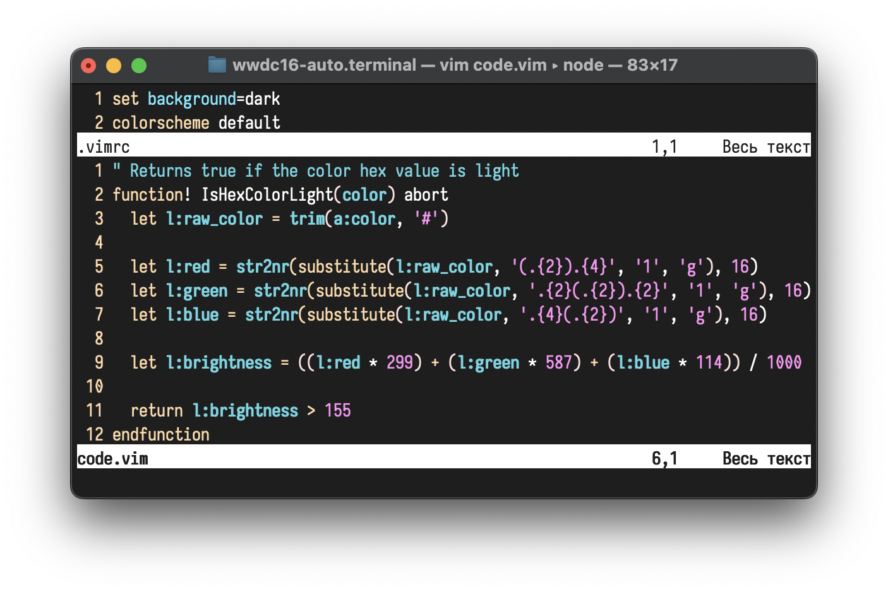
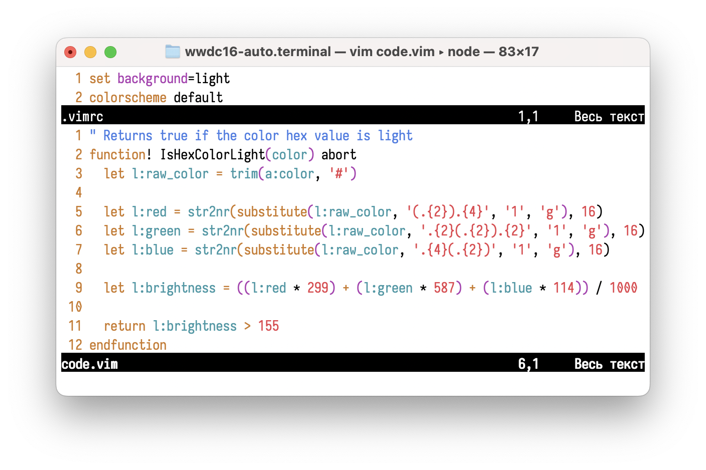

# wwdc16-auto.terminal

[wwdc16.terminal]: https://github.com/jeffkreeftmeijer/wwdc16.terminal
[appsignal.terminal]: https://github.com/jeffkreeftmeijer/appsignal.terminal

ANSI color profile for Terminal.app, based on [wwdc16.terminal] and [appsignal.terminal], depending on the current macOS appearance. Great with Vim's default color scheme.

 


## Installation

```
curl -O https://raw.githubusercontent.com/mokhseem/wwdc16-auto.terminal/main/wwdc16-auto.terminal &&
open wwdc16-auto.terminal
```
